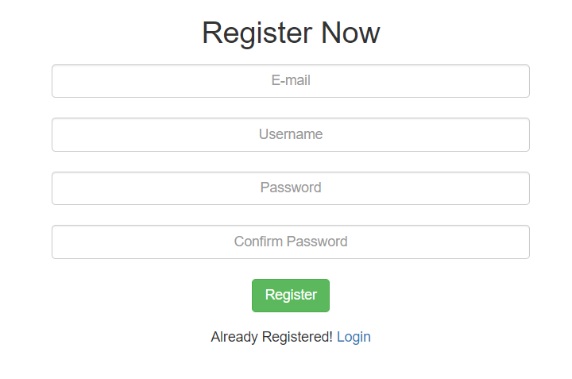
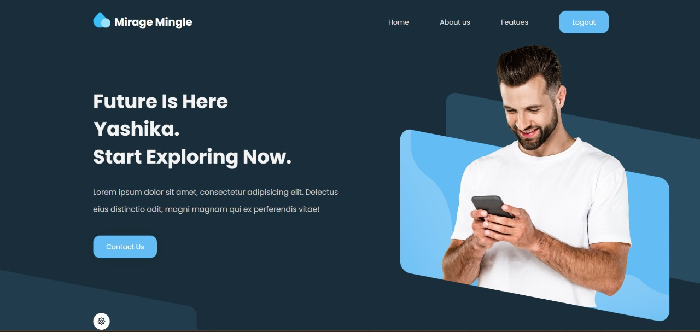
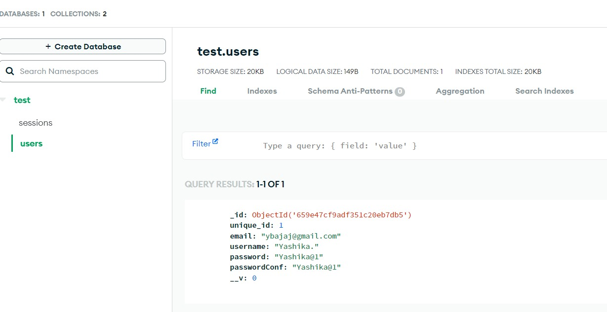
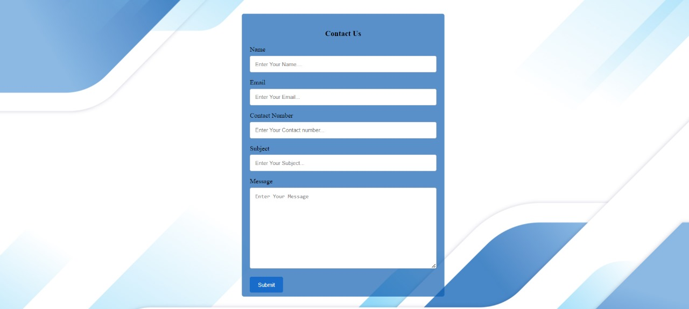
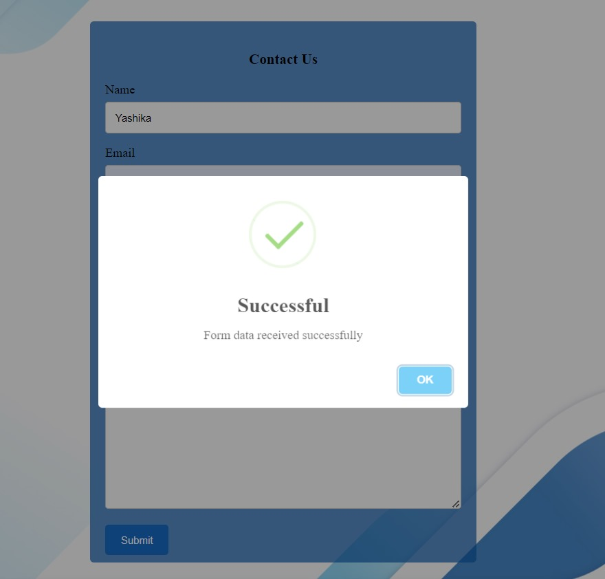

<h1 align="center">
    <b>Mirage Mingle<br> Node.js using MongoDB </b> 
<br>
</h1>

## What is this for?
This is a Simple User Registration & Login systems app done with Node.js Framework using MongoDB(Atlas) as the data store, Express as the routing system, Body-parser as the parser for webpage, Express-session used  to track the user's session and of course Mongoose to make interacting with Mongo from Node easy.
After login, users access a dynamic home page. The app offers a dark/light theme option for personalized viewing. A 'Contact Us' section with a pop-up message system enhances user engagement. The result is a robust, user-friendly application with authentication, dynamic content, and interactive features.

## Getting Started

### Deployment
This Project is **[Live](https://mirage-mingle.onrender.com)** on: 🌍 **https://mirage-mingle.onrender.com**

## Running the tests

### •Registration Form:
Allows the user to register their account by filling their Email, Username, Password.



### •Login Form:
If the user has been registered on the app, can login by passing the credentials.


### •User's Profile:
After the user logged in, a simple profile with the user's username  <br>displayed with a session Logout button.



### •Password Reset:
If the user forget his/her password, can reset by entering the registered Email id <br>and reset the password.


### DataBase:
Here we use **[MongoDB Atlas(Cloud)](https://www.mongodb.com/cloud/atlas)** as the database. Here we have two collection created, named as:
- users.
- sessions.

A Collection(**Users**) is populated with the user's credentials.

<br><br>

A Collection(**session**) is created which stores the users Logged session.


<br>
<br>
<br>

## Prerequisites
Tools that we need to run this app:

- ***[Node.js](https://nodejs.org/en/)***
- ***[Node Package Manager](https://www.npmjs.com/get-npm)***
- ***[MongoDB (Atlas)](https://www.mongodb.com/cloud/atlas)***

## Installing
```
npm install
```
## Connection to DataBase Access
At line 11 on ```./server.js``` change ***```<DB_USERNAME>```*** with your DataBase UserName & ***```<DB_PASSWORD>```*** with your DataBase Password. ybajaj256 Yashika1

## Contact us
- Responsive design
- Input validation
- Success message display (pop up)
 
 


## To Run the App
```
node server.js
```

The server will start Running on
+ http://localhost:3000/


<p align="center">
  Made with ❤️ by <a href="https://github.com/Yashika-Developer">Yashika</a>
</p>
